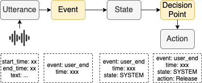
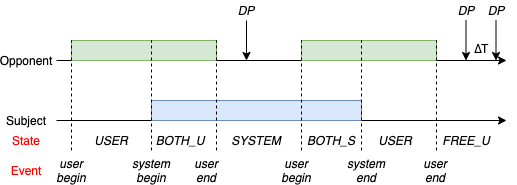
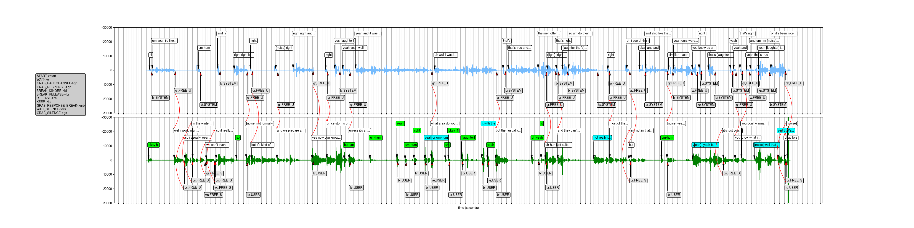

# FTAD - Fine-grained Turn-taking Action Dataset

Dataset for paper "Human-to-Human Conversation Dataset for Learning Fine-grained Turn-taking Action".

## Overview

## Data statistic
 
### Dataset summary

||FTAD-sw|
|---|:--:|
|# of sessions | 2438|
|Avg. session length | 6.33min|
|Avg. session length | 6.33min|
|Word per minute | 201|
|# of Utterances per session | 141.20 |
|# of Utterances per minute | 22.27|
|# of DPs$ per session | 195.32 |
|# of DPs per minute | 30.85|
|# of DPs(w/o Wait) per minute | 13.43|
|Avg. DP alignment error | 420ms |

### Action Distribution
|Action|FTAD-sw|
|---|:--:|
|Grab_Response | 23.7% |
|Grab_Backchannel | 6.1% |
|Grab_Silence | 0.03% |
|Break_Ignore | 3.77% |
|Break_Release | 2.17% |
|Keep | 0.56% |
|Release | 0.88% |
|Grab_Backchannel_Break | 4.71% |
|Grab_Response_Break | 1.34% |
|Wait&Wait_Silence | 56.66% |

## Files
All data files are under FTAD-sw.zip

* `utterrances` contains the strutural annotation of dialogue transcription  
    * `utter.txt`: corpus of dialogue, with each line as an IPU, column separated by tab
    * `decision.txt`: the list of turn-taking decision points and corresponding actions of each dialogue, column separated by tab

* `tasks` contains the turn-taking prediction task data constructed from utterrances
    * `eot.txt`: end of turn prediction
    * `break.txt`: response prediction at opponent's interruption
    * `backchannel.txt`: sequenctial prediction task for backchannel
    * `response_latency.txt`: expected response time prediction

## Data format
### Schema for `utter.txt`
* `session_id`: session id from Switchboard
* `type`: from one speaker’s perspective, 'user' stand for the opponent and 'agent' stand for himself.   
* `id`: utterance sequential id for each speaker, starting from 0
* `begin_time`: begin time (in milliseconds) of current utterance
* `end_time`: end time (in milliseconds) of current utterance
* `begin_decision_id`: corresponding decision point id at utterance begin, -1 means no DP can be associated to this utterance. **Only available for agent utterrances.**
* `end_decision_id`: corresponding decision point id at utterance end, -1 means no DP can be associated to this utterance. **Only available for agent utterrances.**
* `text`: the utterrance text 
* `ext_msg`: some additional annotations generated by pipeline, like shrink tag etc.

### Schema for `decision.txt`
* `session_id`: session id from Switchboard
* `id`: id of decision point
* `time`: timestamp for the decision point
* `state`: duplex state of the dialogue at the moment of DP (illustrated at the top)
* `bias`: the error (in milliseconds) of the aligment between DP at closest utterance, negative value means utterance's event comes before DP
* `act`: the action which suject has taken at this DP
* `ext_msg`: some additional annotations generated by pipeline

